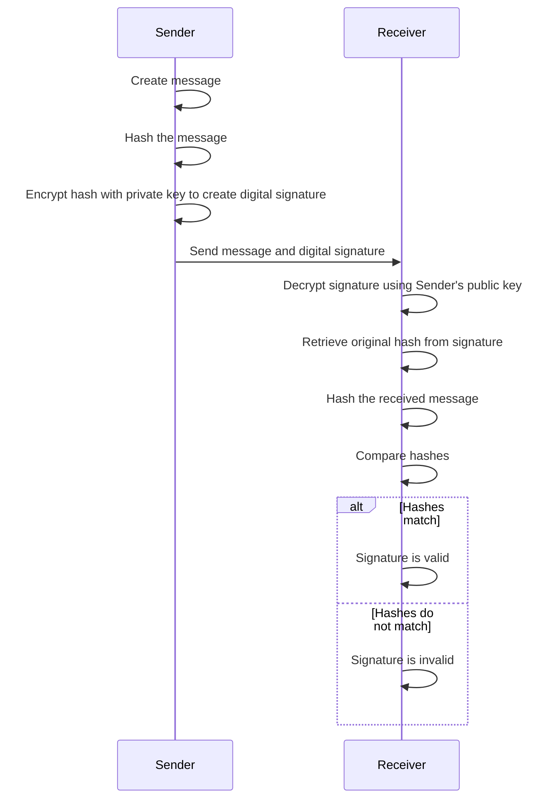
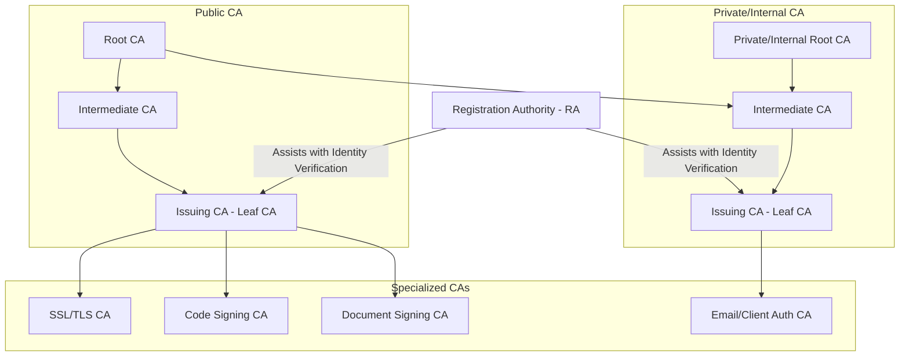
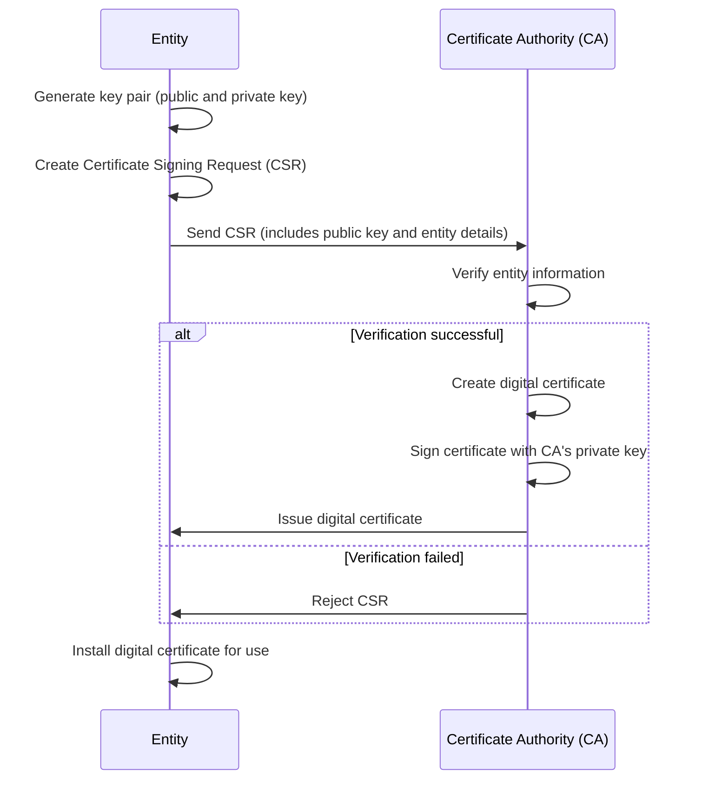
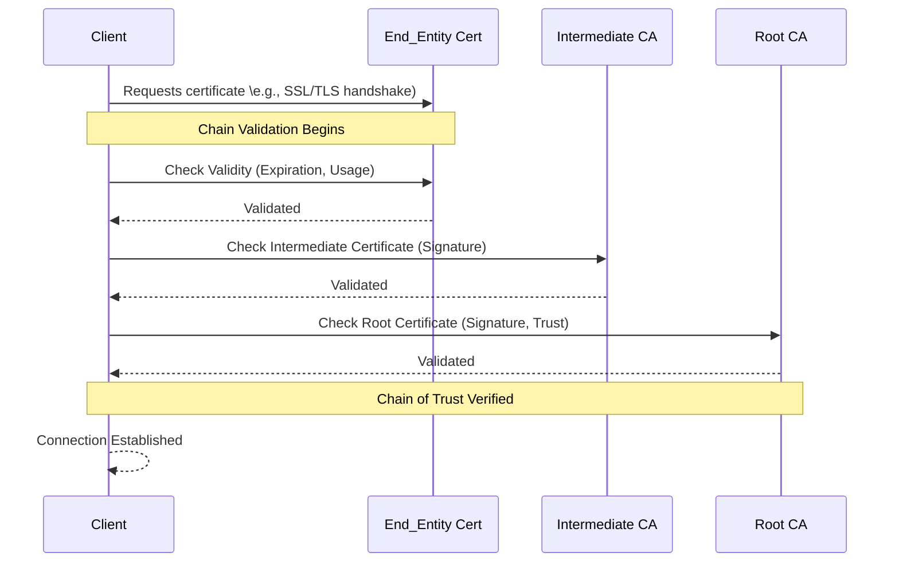

# Digital signature

A digital signature is a cryptographic mechanism created using a private key that ensures the authenticity and integrity of digital messages or documents. 

It verifies that the data has not been altered and confirms the sender's identity, providing a secure way to authenticate information in digital communications.

## Benefits

- **Authentication**: Confirms the sender’s identity since only the sender has the private key to generate the signature.
- **Integrity**: Ensures that the message has not been altered, as even minor changes would alter the hash.
- **Non-repudiation**: The sender cannot deny (repudiate) having sent the message since it’s uniquely linked to their private key.

## Usages

- **Email Authentication**: Verifies the sender's identity and ensures email contents are untampered (e.g., S/MIME).
- **Software Distribution**: Confirms the legitimacy and integrity of software to prevent malware distribution.
- **Digital Contracts and Documents**: Replaces handwritten signatures on legal documents, ensuring authenticity and approval.
- **Blockchain and Cryptocurrencies**: Validates ownership and transactions in decentralized networks, preventing fraud.
- **Electronic Voting**: Secures voter identity and protects the integrity of votes in digital voting systems.
- **Healthcare Records**: Ensures that patient records are authentic, unaltered, and accessible only to authorized parties.
- **Banking and Financial Transactions**: Authenticates transactions and contracts to prevent fraud and ensure traceability.
- **SSL/TLS Certificates**: Used in HTTPS to confirm the identity of websites and encrypt web traffic.
- **Code Signing**: Verifies the source and integrity of code to prevent tampering, often required for mobile apps and software.

### Encrypting web traffic
Key benefits:

- **Data Privacy**: Encryption ensures that sensitive information, such as passwords, personal details, and payment data, remains private and is accessible only to authorized parties.

- **Data Integrity**: By encrypting data, web traffic becomes protected from tampering during transmission. This ensures that data cannot be modified by attackers without detection, safeguarding the accuracy and integrity of information.

- **Authentication**: Encryption often involves certificates (e.g., SSL/TLS) that validate the identity of a website. This protects users from visiting fraudulent or malicious websites, as the encryption certificate ensures the website is legitimate.

- **Confidentiality**: Encrypted traffic prevents eavesdropping by third parties, such as ISPs or hackers on public Wi-Fi, who might otherwise intercept and view sensitive information.

- **Compliance**: Many industries, like finance and healthcare, require encryption to meet regulatory standards (e.g., GDPR, HIPAA), which helps companies avoid legal risks and financial penalties.

- **User Trust**: Websites with HTTPS and secure connections are perceived as more trustworthy, improving user confidence and potentially increasing engagement and transactions.

- **Protection Against Cyber Threats**: Encryption is essential for mitigating threats such as man-in-the-middle (MITM) attacks, where attackers intercept communications, as well as data theft, by ensuring that data is secure during transmission.

## How it works

# Certificate Authority

A Certificate Authority (**CA**) is a trusted organization that issues digital certificates as part of a Public Key Infrastructure (PKI)

Functions:
- Identity Verification: Confirms that the entity requesting a certificate is legitimate.
- Certificate Issuance: Issues digital certificates that allow secure communication and data authentication.
- Certificate Revocation: Maintains and publishes Certificate Revocation Lists (CRLs) or supports Online Certificate Status Protocol (OCSP) for certificate validity status.

## Types of CA

- **Root CA** is at the top of the hierarchy.
  - The highest level in the CA hierarchy, a root CA has a self-signed certificate.
  - Issues certificates to Intermediate CAs, which in turn issue end-user certificates.
  - Root CAs are highly trusted and must be protected due to their critical role in the certificate chain of trust.
- **Intermediate CAs** are linked to either Public or Private CAs, acting as a middle layer to distribute trust.
  - It serves as a link between the root CA and end-users, creating a multi-tier trust model.
  - Issues certificates to end entities (e.g., servers, devices, individuals) or additional lower-level CAs.
  - By limiting the root CA's direct issuance of certificates, intermediate CAs reduce security risks if compromised.
- **Issuing CAs** (Leaf CAs) are the entities directly issuing certificates to end-users or specific applications and services.
  - Optional
  - Primarily responsible for generating and issuing digital certificates for specific purposes (e.g., SSL/TLS, code signing).
  - It is at the end of the chain, providing certificates directly to end entities.
- **Specialized CAs** Can be managed by different Issuing CAs depending on their specific purpose.
  - Optional
  - SSL/TLS CA: Issues certificates specifically for securing web traffic (e.g., HTTPS).
  - Code Signing CA: Issues certificates that validate the authenticity and integrity of software code.
  - Document Signing CA: Issues certificates for digitally signing documents, ensuring their authenticity and integrity.
  - Email/Client Authentication CA: Issues certificates for email security (e.g., S/MIME) and client authentication.

**Public CA**

    A CA that is widely trusted by most devices and browsers. Examples include DigiCert, Let's Encrypt, and GlobalSign.
    - Issues certificates for public-facing websites and services that require broad, universal trust.
    - Public CAs undergo strict audits and are listed in trusted root CA programs (e.g., Microsoft, Mozilla, Apple).

**Private or Internal CA**

    A CA that operates within a private organization and is not trusted outside its designated network or organization.
    Issues certificates for internal purposes, such as securing internal applications, VPNs, and email within a corporate network.
    Not recognized by public CA lists, so it is typically used only within a controlled environment.

**Registration Authority** (RA) Acts as a point of verification before certificate issuance, especially useful in larger organizations where identity verification needs to be delegated.
- Not a CA per se but a trusted entity that assists with certificate requests and verifies user identities on behalf of a CA.

## Best Practices 

### Root CAs Certificates

Root Certificate Authorities (CAs) are foundational to Public Key Infrastructure (PKI) trust chains. Since root certificates are inherently trusted by all downstream certificates, their security is critical. 

#### 1. Minimize Root CA Exposure
   - **Avoid using root CAs for direct issuance of end-entity certificates**. Use intermediate CAs for issuing all operational certificates to reduce the risk of exposing the root CA.

#### 2. Use Offline Root CA
   - **Keep root CA infrastructure offline** to reduce exposure to potential attacks. Root CAs should only be brought online when required, such as for signing or renewing intermediate certificates.

#### 3. Implement Strong Physical Security
   - **Store root CA private keys in Hardware Security Modules (HSMs)** located in secure facilities with strict physical access controls. This ensures physical and cryptographic protection against unauthorized access.

#### 4. Use Long Validity Periods with Periodic Key Rotation
   - Root CA certificates often have extended validity (10+ years). **Rotate root CA certificates periodically** (e.g., every 10–20 years) to maintain cryptographic strength over time.

#### 5. Enforce Strong Cryptographic Standards
   - Generate root CA keys with **strong algorithms and key sizes** (e.g., RSA 4096-bit, ECC P-256). Avoid deprecated algorithms like SHA-1, opting for SHA-256 or stronger hash functions.

#### 6. Limit Root CA to Only Essential Trust Anchors
   - Ensure that root CA certificates are used exclusively for signing intermediate CA certificates. **Restrict root CAs from signing operational certificates** to limit their direct exposure.

#### 7. Regularly Audit Root CA Operations
   - Perform **regular security audits** of the root CA operations and facilities. This includes reviewing root CA certificate policies, usage, and physical security.

#### 8. Document and Communicate Policies
   - Document root CA management policies, including **key management, access control, and issuance policies**. Provide this documentation to relying parties to enhance transparency and trust.

#### 9. Plan for Root CA Migration
   - Root CA migration is a complex process but should be **planned well in advance** of the root certificate expiration. Include guidelines for cross-signing, transitioning, and retiring old root certificates.

### Intermediate CA Certificates

Using intermediate certificates effectively is crucial for security, manageability, and the scalability of Public Key Infrastructure (PKI).

#### 1. Limit the Scope of Intermediate Certificates
   - Assign specific functions to each intermediate certificate, such as issuing certificates only for SSL/TLS, code signing, or client authentication. This reduces the risk of over-permissioning and limits exposure if an intermediate is compromised.

#### 2. Use Multiple Intermediate Certificates
   - Use multiple intermediate certificates to separate different types of certificates (e.g., SSL/TLS vs. client certificates) or serve different environments (e.g., internal vs. external). This allows better management, revocation, and replacement without disrupting unrelated services.

#### 3. Apply Least Privilege
   - Configure intermediate certificates with the minimum privileges needed. This can include restrictions in **Basic Constraints** and **Key Usage** extensions, limiting their ability to issue only specific types of End_Entity certificates.

#### 4. Implement Certificate Revocation Mechanisms
   - Use mechanisms like Certificate Revocation Lists (CRLs) or Online Certificate Status Protocol (OCSP) to enable rapid revocation if an intermediate certificate is compromised. Ensure these mechanisms are properly configured and maintained.

#### 5. Set Appropriate Validity Periods
   - Shorter validity periods for intermediate certificates reduce the impact of potential compromise. Typically, intermediate certificates are set with validity periods of 5-10 years, much shorter than root certificates, which can last 20+ years.

#### 6. Regularly Rotate and Reissue Intermediate Certificates
   - Periodically reissue and replace intermediate certificates to stay ahead of potential cryptographic weaknesses. Regular rotation (e.g., every 5-7 years) also minimizes reliance on outdated cryptography.

#### 7. Store Intermediate Private Keys Securely
   - Store intermediate certificate private keys in secure hardware, like Hardware Security Modules (HSMs). HSMs provide physical and logical protection, preventing unauthorized access or export of private keys.

#### 8. Avoid Directly Using the Root Certificate for Issuing
   - Use intermediate certificates to sign End_Entity certificates rather than directly using the root certificate. This practice minimizes root certificate exposure and creates an extra security layer.

#### 9. Enable Strong Cryptographic Algorithms
   - Ensure intermediate certificates are created using strong cryptographic algorithms and key sizes (e.g., RSA 2048-bit or ECC P-256). Avoid outdated algorithms like SHA-1, opting for SHA-256 or stronger hash functions.

#### 10. Document and Monitor Intermediate Certificates
   - Keep accurate documentation of all intermediate certificates, their issuance, and purpose. Monitor usage and conduct regular audits to detect unusual or unauthorized certificate issuance.

# Digital certificate

A digital certificate is a document issued by a trusted third-party organization called a *Certificate Authority* (**CA**). It verifies the identity of an individual, organization, or server (such as a website). The certificate contains the public key of the certificate holder along with information about the identity it is verifying.

Digital certificates themselves are digitally signed by the *Certificate Authority* (**CA**). This means that a CA’s digital signature is applied to the certificate, verifying its authenticity and that it hasn’t been tampered with. The CA’s signature is trusted because CAs are recognized as reliable third parties.

## Parts (X.509 Standard)

1. Version
   - Specifies the version of the X.509 standard (typically version 3).

2. Serial Number
   - A unique identifier assigned by the Certificate Authority (CA) to distinguish each certificate.

3. Signature Algorithm
   - The algorithm used by the CA to sign the certificate (e.g., SHA-256 with RSA).

4. Issuer
   - Information about the CA that issued the certificate, identifying the trusted authority.

5. Validity Period
   - **Not Before**: The date and time when the certificate becomes valid.
   - **Not After**: The expiration date and time after which the certificate is no longer valid.

6. Subject
   - Information about the entity the certificate is issued to, such as:
     - **Common Name (CN)**: Typically the domain name or entity name.
     - **Organization (O)**
     - **Organizational Unit (OU)**
     - **Location (L)**
     - **State (ST)**
     - **Country (C)**

7. Subject Public Key Info
   - Contains the subject’s public key and the algorithm used with it (e.g., RSA or ECC).

8. Extensions (specific to X.509 version 3)
   - Key Usage: Defines the purposes of the certificate, such as digital signature or key encipherment.
   - Extended Key Usage: Additional uses, like server authentication or email protection.
   - **Subject Alternative Name (SAN)**: Allows alternative identities, such as multiple domain names or IP addresses.
   - Basic Constraints: Indicates if the certificate can be used to issue other certificates (CA status).

9. **Certificate Signature**
   - The digital signature of the certificate, created by the CA using its private key, to verify authenticity.

## How to create a digital certificate

**Private key**

In the context of digital certificates, a private key is a confidential, cryptographic key that pairs with a public key to enable secure data encryption and digital signatures. 
The private key is associated with a digital certificate but *is never included within the certificate itself*; it is generated and held securely by the certificate holder (e.g., a server, individual, or organization).

Characteristics:
- Confidentiality: *The private key must be kept secret*. Only the certificate holder should have access to it, as compromising it would break the security of encrypted communications or signatures.
- Usage in Encryption: When data is encrypted with the public key (included in the digital certificate), only the private key can decrypt it, ensuring that only the certificate holder can access the encrypted information.
- Usage in Digital Signatures: The private key is used to create a digital signature, which can then be verified by others using the public key. This verifies both the authenticity of the message and the identity of the sender.
- Mathematical Pairing with Public Key: The private key and public key are mathematically linked, typically generated as a pair using an algorithm like RSA or ECC. This relationship ensures that data encrypted by one key can only be decrypted by the other.
- Storage and Protection: The private key is usually stored securely on the device where it’s used (e.g., a server or personal device) and protected by encryption, passwords, or hardware security modules (HSMs) to prevent unauthorized access.

**Public key**

In a digital certificate, a public key is a cryptographic key that is publicly available and is used for encrypting data or verifying digital signatures created by the corresponding private key. 
The public key is embedded within the digital certificate and is made available to anyone who needs to communicate securely with the certificate holder.

Characteristics:
- Publicly Accessible: Unlike the private key, the public key *is not secret*. 
It is openly shared within the digital certificate to enable secure communication and verification of digital signatures.
- Encryption: The public key is used to encrypt data that only the corresponding private key can decrypt. 
This ensures that messages encrypted with the public key can only be read by the intended recipient (who holds the private key).
- Digital Signature Verification: The public key is used to verify digital signatures. 
When a document or message is signed with the private key, the public key allows others to verify that the signature is authentic and that the data hasn’t been altered.
- Mathematical Pairing with the Private Key: The public and private keys are mathematically linked, meaning data encrypted with the public key can only be decrypted by the private key, and vice versa. 
This pairing is based on cryptographic algorithms, such as RSA or ECC.
- Inclusion in Digital Certificates: The public key is embedded in the digital certificate along with identifying information about the certificate holder. 
The Certificate Authority (CA) vouches for the public key’s authenticity by signing the certificate with its own private key.

## Certification Chain Validation

Each certificate in the chain must pass validation for the entire chain to be trusted. This process helps prevent the use of untrusted or fraudulent certificates.

## OpenSSL

OpenSSL is a robust, open-source command-line tool for implementing SSL/TLS protocols and performing various cryptographic operations on Linux and other systems. 
It’s widely used for managing certificates and encryption keys, testing secure connections, and supporting secure communications on servers and applications.

It can be used for:

- Certificate Creation and Management: Generate private keys, create Certificate Signing Requests (CSRs), sign certificates (self-signed or with a CA), and convert certificates between formats (e.g., PEM, DER, PFX).
- Testing SSL/TLS Connections: Diagnose SSL/TLS settings by connecting to HTTPS and other secure services, useful for troubleshooting certificates and protocol configurations.
- Encryption and Decryption: Encrypt or decrypt files and data using symmetric (AES) and asymmetric (RSA) algorithms.
- Hashing: Generate hashes (e.g., SHA-256) to verify data integrity.
- Key Generation: Create public-private key pairs for encryption and signing.

### Links
- [Command-line examples how to use OpenSSL](./openssl.md)
- [Scripts to create RootCA, Intermediate CA and Certificates](https://github.com/Emmerson-Miranda/openssl)

