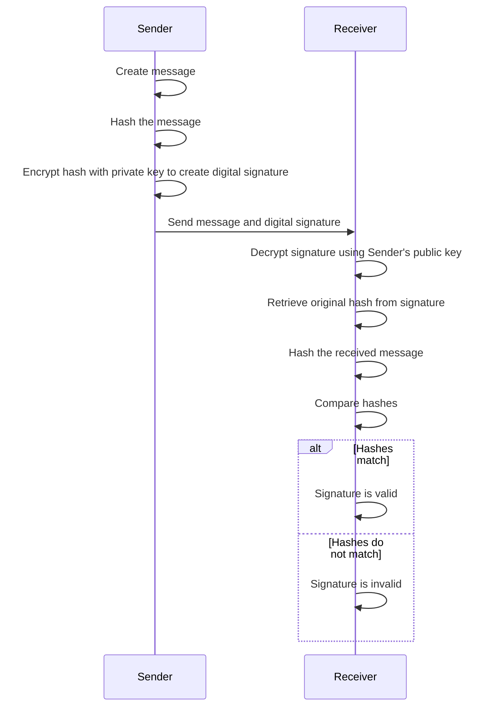

# How a digital signature works

```mermaid
sequenceDiagram
    participant Sender
    participant Receiver

    Sender->>Sender: Create message
    Sender->>Sender: Hash the message
    Sender->>Sender: Encrypt hash with private key to create digital signature
    Sender->>Receiver: Send message and digital signature

    Receiver->>Receiver: Decrypt signature using Sender's public key
    Receiver->>Receiver: Retrieve original hash from signature
    Receiver->>Receiver: Hash the received message
    Receiver->>Receiver: Compare hashes

    alt Hashes match
        Receiver->>Receiver: Signature is valid
    else Hashes do not match
        Receiver->>Receiver: Signature is invalid
    end
```