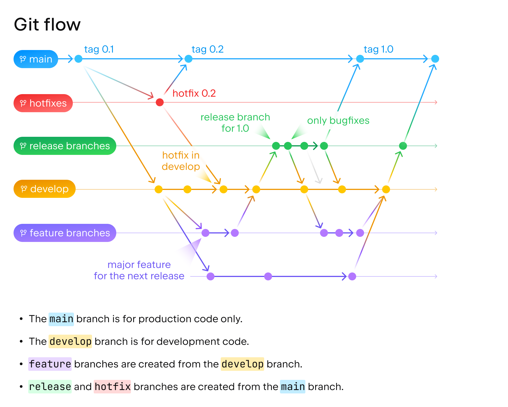
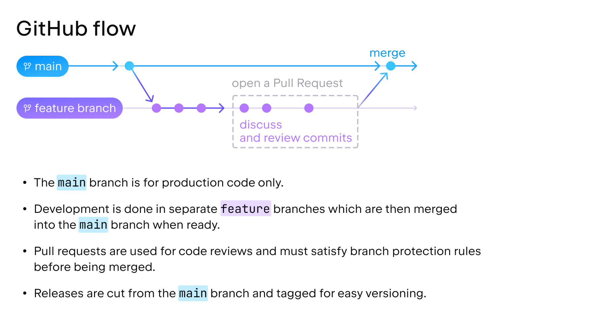
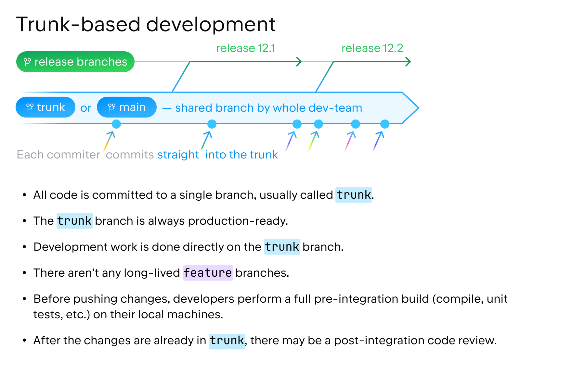
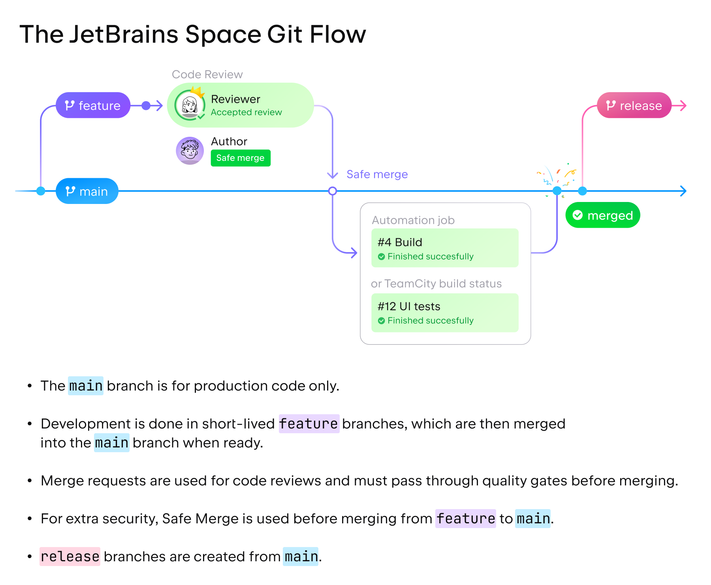

# GIT

## Install graphical interface

```
sudo yum install git-gui
```

## Open graphical interface

```
gitk
```

## Commands

### Changing the repo location

Note: Some organizations use different name to master branch.

```bash
git switch master
git remote rm origin
git remote add origin git@your.gitserver.com:your-new-repo.git
git branch --set-upstream-to=origin/master master
git pull
```

### Forcing to use ssh instead of https

Edit */.gitconfig* file and instruct to use ssh instead https to https sources.

```bash
[url "git@your.git.server.com:"]
        insteadOf = https://your.git.server.com/
```


## Branching strategy

Define a naming convention that suits to the team.

Source: [Introducing the Space Git Flow](https://blog.jetbrains.com/space/2023/04/18/space-git-flow/)


### Git flow

[jgit-flow](https://bitbucket.org/atlassian/jgit-flow/wiki/Home), it has performance differences between use "git:" and "https:" protocols.

Connection credentials on the maven plugin.
````
<build>
    <plugins>
        <plugin>
            <groupId>external.atlassian.jgitflow</groupId>
            <artifactId>jgitflow-maven-plugin</artifactId>
            <version>1.0-m5.1</version>
            <configuration>
                <username>${git.username}</username>
                <password>${git.password}</password>
                <!-- see goals wiki page for configuration options -->
            </configuration>
        </plugin>
    </plugins>
</build>
````


[How to make a release with Git and Maven via JGitFlow](https://gist.github.com/lemiorhan/97b4f827c08aed58a9d8)



### GitHub flow



### Trunk-Based



### Jetbrains Space Git flow


